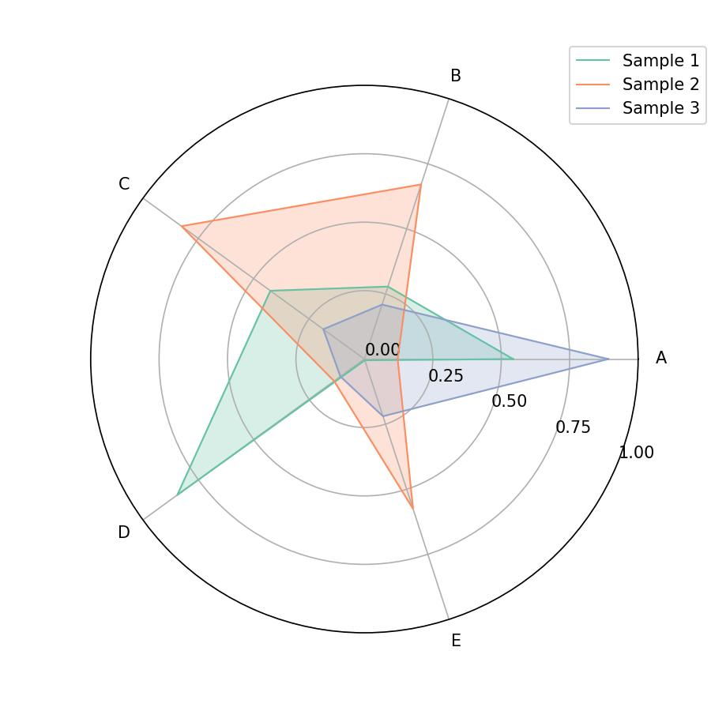

Welcome to the `matplotlib-radar` documentation!
================================================

.. image:: https://codecov.io/gh/harryhaller001/matplotlib-radar/graph/badge.svg?token=WO0CGOVJOH
   :target: https://codecov.io/gh/harryhaller001/matplotlib-radar

.. image:: https://img.shields.io/pypi/v/matplotlib-radar
   :alt: PyPI - Version

.. image:: https://img.shields.io/pypi/l/matplotlib-radar
   :alt: PyPI - License

.. image:: https://img.shields.io/pypi/pyversions/matplotlib-radar
   :alt: PyPI - Python Version

Feature-rich generation of radar chart based on matplotlib.

Content
-------

.. toctree::
   :caption: Start
   :maxdepth: 4
   :glob:

   installation
   notebooks/example

.. toctree::
   :caption: API Documentation
   :maxdepth: 4
   :glob:

   autoapi/matplotlib_radar/index

Indices and tables
------------------

* :ref:`genindex`
* :ref:`modindex`
* :ref:`search`
